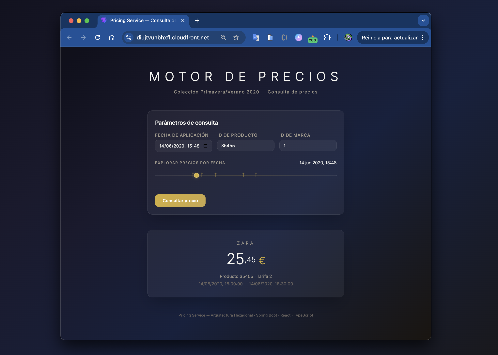
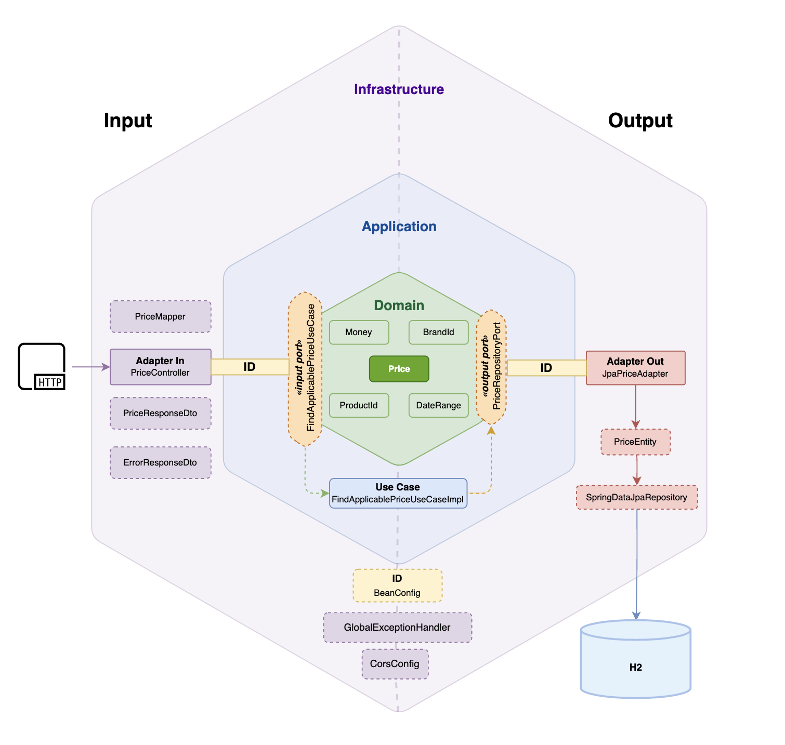
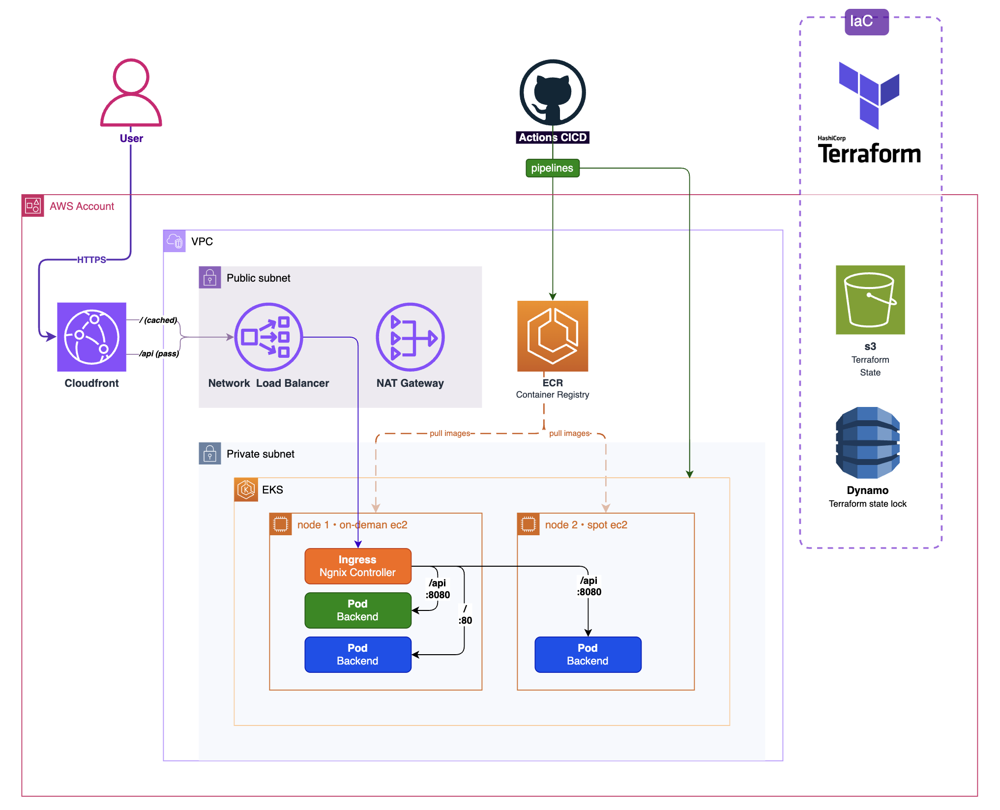
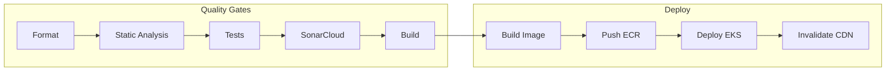

# Pricing Engine

[](https://github.com/oveland/pricing-engine/actions/workflows/backend-ci.yml)
[](https://github.com/oveland/pricing-engine/actions/workflows/frontend-ci.yml)
[](https://github.com/oveland/pricing-engine/actions/workflows/infra.yml)
[](https://sonarcloud.io/summary/overall?id=pricing-engine-backend)
[](https://sonarcloud.io/summary/overall?id=pricing-engine-backend)

API REST que determina el precio aplicable de un producto para una marca en una fecha dada. Cuando múltiples tarifas se solapan en rangos de fechas, prevalece la de mayor prioridad.

## Live

- **App:** https://diujtvunbhxfl.cloudfront.net
- **API:** https://diujtvunbhxfl.cloudfront.net/api/prices?date=2020-06-14T16:00:00&productId=35455&brandId=1
- **Swagger UI:** [Ver especificación OpenAPI](https://petstore.swagger.io/?url=https://raw.githubusercontent.com/oveland/pricing-engine/master/backend/src/main/resources/openapi.yaml)

<p align="center">
  
</p>

## Tech Stack

| Capa | Tecnologías |
|------|-------------|
| Backend | Java 17, Spring Boot 3.4, Spring Data JPA, H2, Flyway |
| Frontend | React 19, TypeScript, Vite, Tailwind CSS |
| Infraestructura | Amazon EKS, Terraform, Docker, Nginx |
| CI/CD | GitHub Actions, Amazon ECR |
| Calidad | JUnit 5, Mockito, SonarCloud, SpotBugs, PMD |

## Arquitectura

El proyecto implementa **Arquitectura Hexagonal (Ports & Adapters)** con principios de Domain-Driven Design para el backend:

<p align="center">
  
</p>

Las dependencias apuntan hacia adentro: infraestructura → aplicación → dominio. El dominio no conoce Spring ni JPA.

### Estructura del código

```
com.pricing/
├── domain/
│   ├── model/           Price, Money, BrandId, ProductId, DateRange
│   ├── port/input/      FindApplicablePriceUseCase
│   ├── port/output/     PriceRepositoryPort
│   └── exception/       PriceNotFoundException
├── application/
│   └── usecase/         FindApplicablePriceUseCaseImpl
└── infrastructure/
    ├── adapter/input/   PriceController, DTOs
    ├── adapter/output/  JpaPriceAdapter, PriceEntity
    ├── config/          BeanConfig, CorsConfig
    ├── mapper/          PriceMapper
    └── exception/       GlobalExceptionHandler
```

## Infraestructura Cloud

La aplicación corre en Amazon EKS, gestionada completamente con Terraform y desplegada automáticamente mediante GitHub Actions.

<p align="center">
  
</p>

| Recurso | Especificación |
|---------|---------------|
| CDN | CloudFront con HTTPS (certificado AWS), caché para frontend, pass-through para API |
| Cluster | EKS v1.31, control plane managed by AWS, endpoint público |
| Nodos | 1x t3.small On-Demand + 1x t3.small Spot (2 AZs) |
| Networking | VPC con subnets públicas/privadas, NAT Gateway (single), Internet Gateway |
| Ingress | NGINX Ingress Controller + Network Load Balancer (L4) |
| Registry | Amazon ECR con scan de vulnerabilidades y lifecycle policy (5 imágenes max) |
| IaC | Terraform con state en S3 + DynamoDB lock + KMS encryption |
| Addons | CoreDNS, kube-proxy, VPC-CNI |

## CI/CD

Cada push a `master` ejecuta el pipeline completo: validación de calidad, build de imagen Docker, push a ECR y deploy automático a EKS.



## API

### Consultar precio aplicable

```
GET /api/prices?date={ISO-8601}&productId={id}&brandId={id}
```

**Ejemplo:**
```bash
curl "https://diujtvunbhxfl.cloudfront.net/api/prices?date=2020-06-14T16:00:00&productId=35455&brandId=1"
```

**Respuesta (200):**
```json
{
  "productId": 35455,
  "brandId": 1,
  "priceList": 2,
  "startDate": "2020-06-14T15:00:00",
  "endDate": "2020-06-14T18:30:00",
  "price": 25.45,
  "currency": "EUR"
}
```

**Errores:** 400 (parámetros inválidos), 404 (precio no encontrado)

La especificación completa está en [`backend/src/main/resources/openapi.yaml`](backend/src/main/resources/openapi.yaml).

## Tests

```bash
cd backend && mvn verify
```

**68 tests** organizados en tres niveles:

| Nivel | Tests | Descripción |
|-------|-------|-------------|
| Unitarios | 52 | Value Objects, Price, caso de uso (Mockito) |
| Integración | 6 | JPA adapter + H2 + Flyway |
| Sistema | 5 | Endpoint REST completo |
| Arquitectura | 5 | Validación de dependencias hexagonales |
| **Total** | **68** | |

### Los 5 escenarios de sistema

| # | Fecha | Tarifa | Precio |
|---|-------|--------|--------|
| 1 | 2020-06-14 10:00 | 1 | 35.50 EUR |
| 2 | 2020-06-14 16:00 | 2 | 25.45 EUR |
| 3 | 2020-06-14 21:00 | 1 | 35.50 EUR |
| 4 | 2020-06-15 10:00 | 3 | 30.50 EUR |
| 5 | 2020-06-16 21:00 | 4 | 38.95 EUR |

## Ejecución local

### Con Docker

```bash
docker-compose up --build
```

- **Frontend:** http://localhost:3000
- **Backend:** http://localhost:8080
- **H2 Console:** http://localhost:8080/h2-console

### Sin Docker

```bash
# Backend
cd backend && mvn spring-boot:run

# Frontend
cd frontend && npm install && npm run dev
```

## Estructura del repositorio

```
pricing-engine/
├── backend/             Spring Boot API
├── frontend/            React + TypeScript
├── deploy/              Manifiestos Kubernetes
├── infra/               Terraform (EKS, VPC, ECR)
├── .github/workflows/   CI/CD pipelines
└── docker-compose.yml   Entorno local
```

## Decisiones de diseño

- **API First** — Contrato OpenAPI 3.0 definido antes de la implementación
- **Rich Domain Model** — La resolución por prioridad vive en el dominio, no en un servicio
- **Value Objects como records** — Inmutables, con validación en el constructor
- **Tres modelos separados** — `Price` (dominio) ≠ `PriceEntity` (JPA) ≠ `PriceResponseDto` (API)
- **Caso de uso sin @Service** — Instanciado en `BeanConfig`, capa de aplicación libre de Spring
- **Infraestructura como código** — Terraform con state remoto, reproducible y versionado
- **CloudFront como CDN** — HTTPS gratis, caché de assets estáticos, invalidación automática en deploy
- **Nodos Spot** — Reducción de costos ~90% en nodos no críticos
- **Deploy automatizado** — Zero-touch deployment desde push hasta producción
- **TDD** — Tests escritos antes de la implementación (visible en historial de commits)

## Quality

| Métrica | Herramienta | Alcance |
|---------|-------------|---------|
| Cobertura de código | JaCoCo + SonarCloud | Backend |
| Análisis estático | PMD, SpotBugs | Backend |
| Code smells & bugs | SonarCloud | Backend + Frontend |
| Formato | Spotless (Java), Prettier (TS) | Ambos |
| Linting | PMD (Java), ESLint (TS) | Ambos |
| Vulnerabilidades | SonarCloud + ECR Scan | Código + Imágenes Docker |
| Arquitectura | ArchUnit | Validación de dependencias hexagonales |

## Evolutivos

Mejoras identificadas para una siguiente iteración:

| Área | Mejora | Beneficio |
|------|--------|-----------|
| Persistencia | Migrar de H2 a PostgreSQL (RDS) | Datos persistentes entre reinicios |
| Caché | Redis/ElastiCache para respuestas frecuentes | Reducción de latencia y carga en DB |
| Seguridad | API Key o JWT en el endpoint | Control de acceso |
| Observabilidad | Prometheus + Grafana + CloudWatch | Métricas, alertas, dashboards |
| Resiliencia | HPA (Horizontal Pod Autoscaler) | Escalado automático por carga |
| Dominio | Soporte multi-currency con tasas de cambio | Extensibilidad del modelo |
| CI/CD | Canary deployments con Argo Rollouts | Despliegues progresivos sin downtime |
| Networking | Dominio custom + cert-manager + Let's Encrypt | URL profesional con TLS propio |

